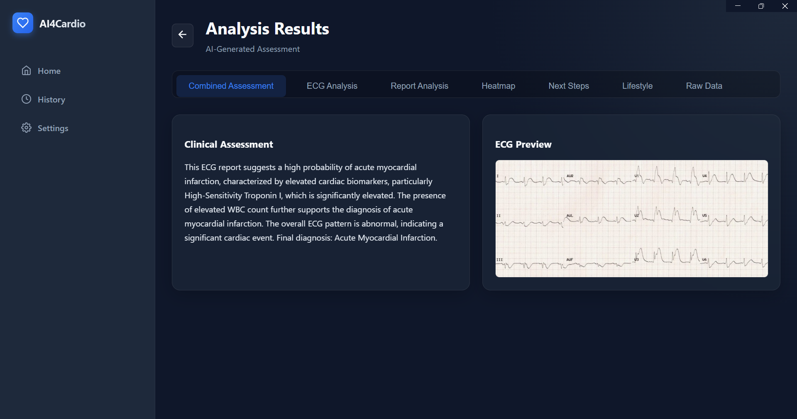
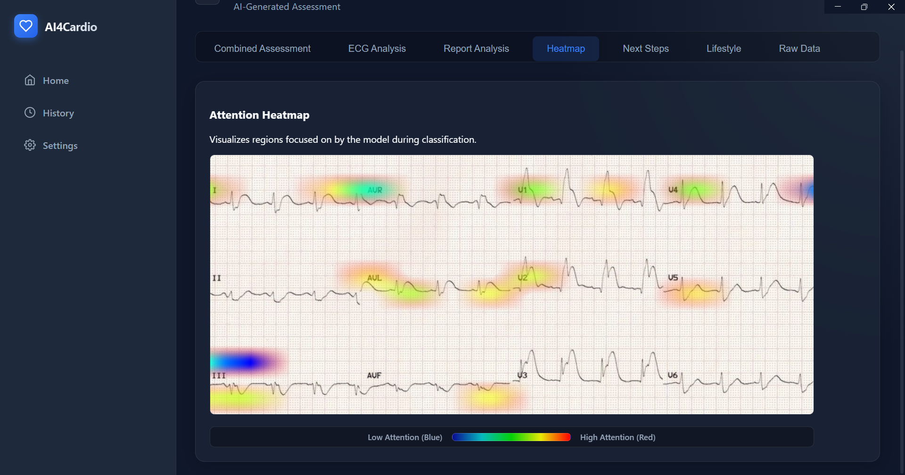

# AI4Cardio - Electron App

Offline Desktop App for Multimodal ECG & Report Analysis.

🚀 **[Download AI4Cardio Windows App (.exe) Here](https://storage.googleapis.com/courseai/AI4Cardio-Electron%20Setup%201.0.0.exe)**




## Prerequisites

- **Node.js**: v18 or higher
- **Yarn**: `npm install -g yarn`
- **Models**: Ensure `model/` directory contains:
    - `ggml-model-q4_k_m.gguf` (MedGemma-4B)
    - `mmproj-medgemma-4b-ecginstruct-F16.gguf` (Projector)
    - `vision_encoder_quant.onnx` (Vision Encoder)

## Development

1.  **Install Dependencies**:
    ```bash
    yarn
    ```

2.  **Start App**:
    ```bash
    yarn start
    ```

## Build (Windows)

To create a standalone `.exe` installer:

1.  Run the build script:
    ```cmd
    build.bat
    ```
2.  The output installer will be in the `dist/` folder.
