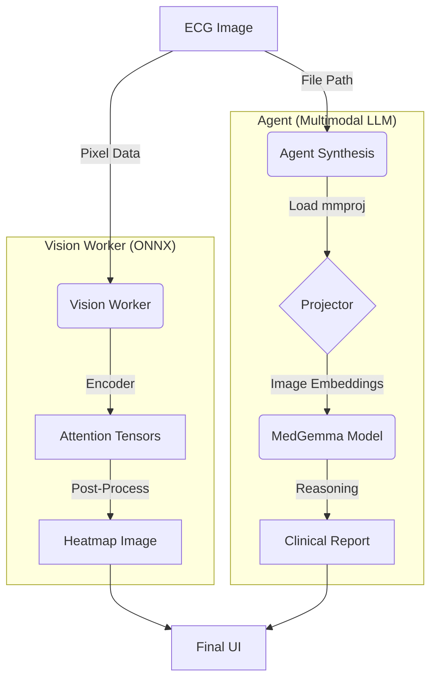

# Architecture: Hybrid Multimodal Integration

In the Electron application, we use a **Hybrid Architecture** that leverages the strengths of two distinct model types: **ONNX** for interpretability and **GGUF (Multimodal)** for reasoning.

## 1. The Workflow

### Step 1: Visual Interpretability (The "Eye")
- **Component:** `vision_worker.mjs`
- **Model:** `vision_encoder_quant.onnx`
- **Why ONNX?** It exposes raw **Attention Tensors**.
- **Action:**
    1.  Takes the raw ECG image.
    2.  Runs the Vision Encoder.
    3.  Extracts attention weights to generate the **Heatmap Overlay**.
    4.  **Output:** A visual heatmap file (e.g., `heatmap_123.png`).

### Step 2: Multimodal Reasoning (The "Brain")
- **Component:** `agent.js` (Synthesis Node)
- **Model Files:** `ggml-model-q4_k_m.gguf` + `mmproj-medgemma-4b-ecginstruct-F16.gguf`
- **Base Model:** [`google/medgemma-4b-it`](https://huggingface.co/google/medgemma-4b-it) (Google MedGemma 4B Instruct, built on Gemma 3)
- **Fine-Tune:** [`convaiinnovations/medgemma-4b-ecginstruct`](https://huggingface.co/convaiinnovations/medgemma-4b-ecginstruct) (ECG-specialized via Unsloth + LoRA)
- **Architecture:**
    -   **LLM:** Gemma 3 decoder-only transformer (4B parameters)
    -   **Vision Encoder:** SigLIP 400M, pre-trained on de-identified medical images (896×896 input)
    -   **Projector (`mmproj`):** Maps SigLIP embeddings into the Gemma 3 token space
- **Action:**
    1.  The Agent passes the **Original ECG Image Path** directly to the LLM.
    2.  The `mmproj` (Projector) maps the image into the LLM's embedding space.
    3.  The LLM generates the **ECG Analysis**, **Clinical Assessment**, and **Recommendations** based on the actual pixel data.
    4.  **Output:** Structured clinical text.

## 2. Diagram

## 3. Why Two Models?

We use a "Best of Both Worlds" approach:

| Feature | ONNX Model | Multimodal LLM (GGUF + mmproj) |
|---|---|---|
| **Primary Role** | Visualization (Heatmap) | Reasoning & Text Generation |
| **Strengths** | *Transparent*: We can access internal attention weights to draw the heatmap. | *Powerful*: Can understand complex visual patterns and generate human-like reports. |
| **Weaknesses** | *Dumb*: Cannot generate coherent medical text on its own. | *Opaque*: `llama.cpp` hides internal attention weights, preventing heatmap generation. |

By running them in parallel, we get **both** the visual proof (Heatmap) and the expert analysis (Report).
